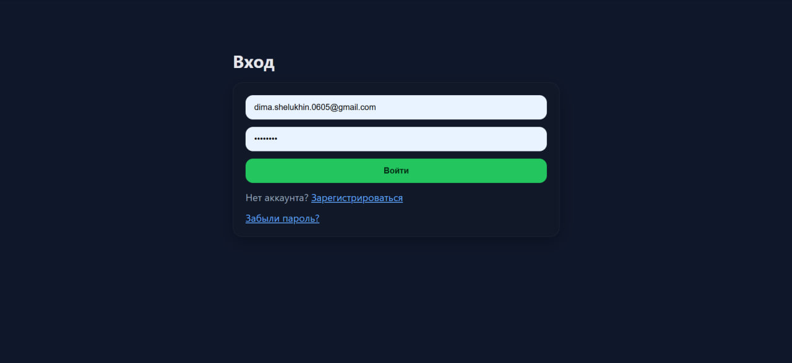
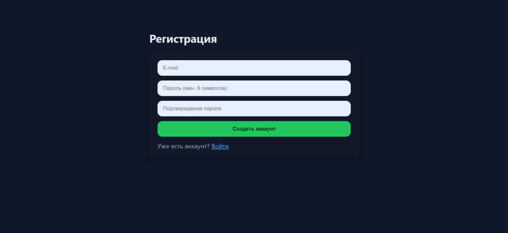
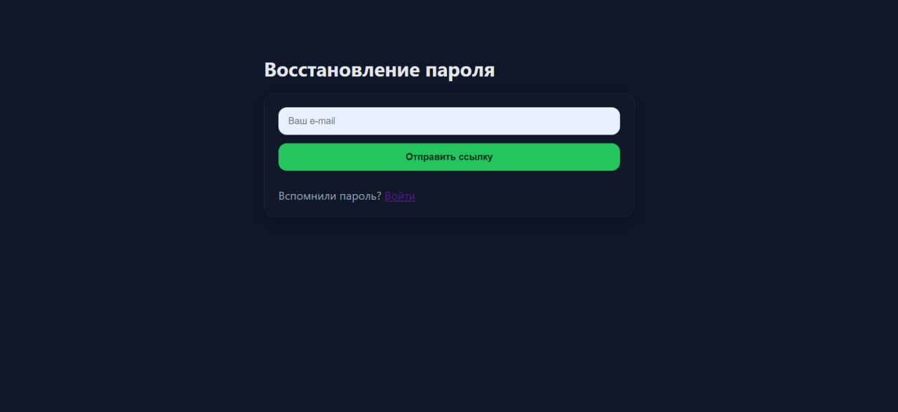
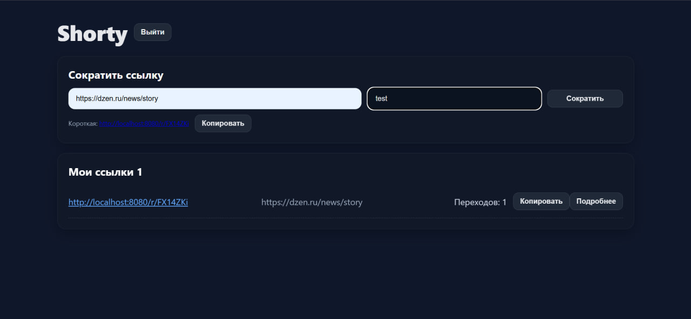
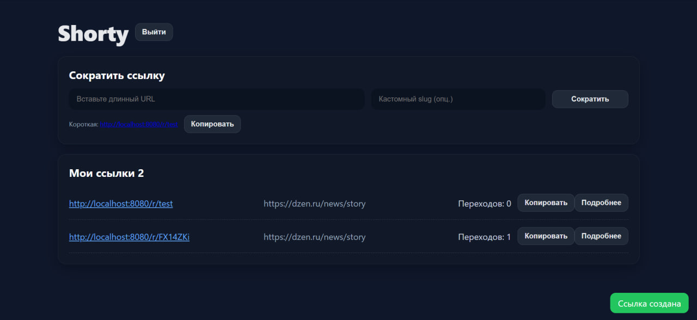
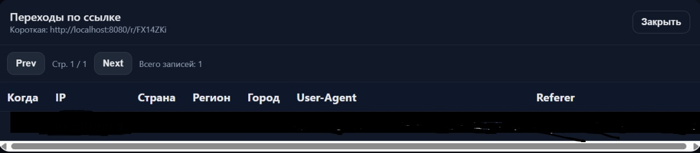

# Shorty — сервис коротких ссылок

Shorty — это небольшой сервис для сокращения ссылок с авторизацией, аналитикой переходов и управлением своими короткими URL.  
Проект создан для демонстрации работы полного цикла веб-приложения: от регистрации пользователя и JWT-аутентификации до отслеживания переходов по ссылкам и отображения статистики.

---

## Описание проекта

Пользователь может зарегистрироваться, подтвердить свой e-mail, войти в систему, создавать короткие ссылки (в том числе с кастомным slug), смотреть список своих ссылок и аналитику переходов.  
Для каждой короткой ссылки сохраняется информация о количестве переходов, IP-адресах, User-Agent, стране, реферере и другой дополнительной информации.

---

## Основные возможности

- Регистрация и вход с использованием JWT.
- Подтверждение электронной почты после регистрации.
- Восстановление пароля через e-mail.
- Создание коротких ссылок с возможностью задать собственный slug.
- Отображение списка своих ссылок и переходов по ним.
- Счётчик переходов с хранением в Redis.
- Аналитика переходов по ссылке (IP, страна, город, реферер, браузер, устройство и т.д.).
- Возможность ограничивать срок жизни ссылки и количество переходов.
- Хэширование паролей (BCrypt).
- Уведомления по почте при восстановлении и подтверждении e-mail.

---

## Используемые технологии

**Backend:**  
Java 17, Spring Boot (Web, Security, Data JPA, Validation), Flyway, JavaMailSender, JWT (Nimbus JOSE + JWT)

**Database:**  
PostgreSQL

**Cache:**  
Redis (счётчики переходов и временные токены)

**Frontend:**  
HTML, CSS, JavaScript (без фреймворков, простая вёрстка)

**Инфраструктура:**  
Maven, Logback, профили `application.yml`, Docker для локального запуска

---

## Скриншоты интерфейса


**Страница входа**


**Регистрация**


**Восстановление пароля**


**Главная страница (создание ссылки)**


**Главная страница (отображение ссылок пользователя)**


**Аналитика переходов**



---

## Запуск проекта локально

### Требования

- Установленный JDK 17+
- PostgreSQL (можно через Docker)
- Redis
- Почтовый SMTP-сервер (для локальной разработки можно использовать MailHog)

### Настройка конфигурации

Создайте файл `application.yml` (или используйте `application-docker.yml`).  
Основные параметры:

- PostgreSQL: `spring.datasource.url`, `spring.datasource.username`, `spring.datasource.password`
- Redis: `spring.data.redis.host`, `spring.data.redis.port`
- JWT секрет: `jwt.secret` (или переменная окружения `JWT_SECRET`)
- URL приложения (для писем): `app.public-url`
- SMTP: `spring.mail.host`, `spring.mail.port`, `spring.mail.username`, `spring.mail.password`
- `mail.from` — адрес, с которого будут уходить письма

Пример ENV переменных:

| Ключ | Назначение | Пример |
|------|-------------|--------|
| spring.datasource.url | PostgreSQL URL | jdbc:postgresql://localhost:5450/shorty |
| spring.datasource.username | Имя пользователя БД | postgres |
| spring.datasource.password | Пароль БД | postgres |
| spring.data.redis.host | Хост Redis | localhost |
| spring.data.redis.port | Порт Redis | 6379 |
| jwt.secret | Секрет для подписи токенов | your-secret-key |
| app.public-url | Базовый URL приложения | http://localhost:8080 |
| spring.mail.host | SMTP сервер | smtp.gmail.com |
| mail.from | От кого отправляются письма | Shorty <noreply@shorty.local> |

---

### Запуск через Maven

```bash
./mvnw spring-boot:run
